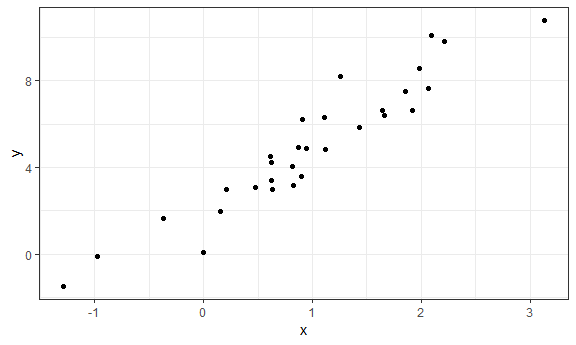

Writing functions
================

``` r
x = rnorm(25, mean = 5, sd = 3)

(x - mean(x)) / sd(x)
##  [1] -1.12113997 -0.67940582  2.10344866  0.88236568 -0.23330427
##  [6]  0.21084551 -1.01918143 -0.19604083  0.22622366 -1.01738521
## [11] -0.19779431  1.75051576  2.58305550  0.50379333 -0.56409559
## [16] -0.35373509 -0.83207535 -0.33101538 -1.31742490 -0.99670181
## [21] -0.18759629  0.24050082 -0.01665178  0.81088951 -0.24809039
```

``` r
z_scores = function(x) {
  
  z = (x - mean(x)) / sd(x)
  z
  
}

z_scores(x)
##  [1] -1.12113997 -0.67940582  2.10344866  0.88236568 -0.23330427
##  [6]  0.21084551 -1.01918143 -0.19604083  0.22622366 -1.01738521
## [11] -0.19779431  1.75051576  2.58305550  0.50379333 -0.56409559
## [16] -0.35373509 -0.83207535 -0.33101538 -1.31742490 -0.99670181
## [21] -0.18759629  0.24050082 -0.01665178  0.81088951 -0.24809039
```

``` r
unif_sample = runif(100)

z_scores(x = unif_sample)
##   [1]  1.068860924  0.181125849 -1.515955354 -1.063344077  1.671540108
##   [6] -0.943585256  0.056057678  0.699728593  1.012956488  1.201352823
##  [11] -0.305525511 -1.254749300 -1.630706240  0.111820365 -1.261263348
##  [16] -0.852013639  0.293182106 -0.669579983  0.034543357 -1.219680837
##  [21] -0.765295951  1.496252521  0.825811615 -1.654099936  0.294510014
##  [26]  0.042729884  1.156014292 -0.261414316  0.490687383 -1.362697192
##  [31] -1.648508963 -1.077674958  1.298390351  0.708817506  0.747078117
##  [36] -0.843463251 -0.823413734  1.789700534  1.342093198 -0.463019945
##  [41]  1.713932048 -0.132277021 -0.315245675 -0.049876500 -1.022675226
##  [46] -1.031458840 -0.125772769  0.020373621  1.457367964 -1.366779879
##  [51] -0.112773706 -0.243423961 -1.116085198 -0.276469555  0.289636949
##  [56]  1.788747946 -1.020320310  1.117500334 -0.716124240 -0.498975199
##  [61]  0.081869075 -0.945392963  1.053633041  1.608762236  0.422677173
##  [66]  1.020777756 -1.324053736 -0.639301198 -0.067679495  0.372038709
##  [71]  0.174383522 -1.088464602 -1.192918806  0.991147325 -0.891894298
##  [76]  0.789380393 -0.936490946  1.281218827 -1.368473692 -0.547755282
##  [81]  0.942284769 -0.007858986  0.117766119 -1.125397635 -1.487407694
##  [86]  1.151356785 -0.432784391  1.236349829  1.792122493 -0.331855725
##  [91] -0.607596860  0.903417966  1.337903120  1.637608703 -0.702736309
##  [96]  1.164546558  1.083986477 -0.191598381 -1.174417359  0.634284789
```

Add checks

``` r
z_scores = function(x) {
  
  if (!is.numeric(x)) {
    stop("Argument x should be numeric")
  } else if (length(x) == 1) {
    stop("Z scores cannot be computed for length 1 vectors")
  }
  
  z = mean(x) / sd(x)
  
  z
}
```

### mean

``` r
mean_and_sd = function(x) {
  
  if (!is.numeric(x)) {
    stop("Argument x should be numeric")
  } else if (length(x) == 1) {
    stop("Cannot be computed for length 1 vectors")
  }
  
  tibble(
  mean_x = mean(x),
  sd_x = sd(x)
)
  
 
}

mean_and_sd(unif_sample)
## # A tibble: 1 x 2
##   mean_x  sd_x
##    <dbl> <dbl>
## 1  0.479 0.287
```

Multiple Inputs
---------------

Simple regression.

``` r
sim_data = tibble(
  x = rnorm(30, mean = 1, sd = 1),
  y = 2 + 3 * x + rnorm(30, 0, 1)
)

sim_data
## # A tibble: 30 x 2
##          x     y
##      <dbl> <dbl>
##  1  1.91    8.02
##  2  2.39   10.9 
##  3  1.21    6.49
##  4  2.11    9.17
##  5  0.912   2.29
##  6  0.526   2.35
##  7 -0.0732  2.29
##  8  1.98    7.96
##  9  0.867   2.99
## 10  1.97    9.44
## # ... with 20 more rows
sim_data %>% 
  ggplot(aes(x = x, y = y)) + geom_point()
```



``` r

ls_fit = lm(y ~ x, data = sim_data)
  
beta0_hat = coef(ls_fit)[1]
beta1_hat = coef(ls_fit)[2]
```

Write a function that simulates data, fits the model, annd returns the estimate. Inputs are sample size and true cofficients.

``` r
sim_regression = function(n, beta0, beta1) {
  
  sim_data = tibble(
    x = rnorm(n, mean = 1, sd = 1),
    y = beta0 + beta1 * x + rnorm(n, 0, 1)
  )
  
  ls_fit = lm(y ~ x, data = sim_data)
  
  tibble(
    beta0_hat = coef(ls_fit)[1],
    beta1_hat = coef(ls_fit)[2]
  )
}
```

``` r
sim_regression(n = 100, beta0 = 0.2, beta1 = 1.3)
## # A tibble: 1 x 2
##   beta0_hat beta1_hat
##       <dbl>     <dbl>
## 1   -0.0189      1.36
```
