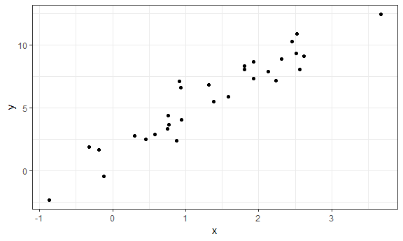

Writing functions
================

``` r
x = rnorm(25, mean = 5, sd = 3)

(x - mean(x)) / sd(x)
##  [1]  0.3376508  0.4270091 -0.1641960 -0.9581860  1.2182554  0.7871590
##  [7] -2.1894656  0.6703307  0.9219803 -0.4155782  0.5082260 -0.3424310
## [13] -1.8714994  1.7746182 -1.0253824 -0.4980498  0.9991217 -0.8131618
## [19]  0.2501420 -1.2685375 -0.6713219  0.9004561  0.8517252  0.8244998
## [25] -0.2533646
```

``` r
z_scores = function(x) {
  
  z = (x - mean(x)) / sd(x)
  z
  
}

z_scores(x)
##  [1]  0.3376508  0.4270091 -0.1641960 -0.9581860  1.2182554  0.7871590
##  [7] -2.1894656  0.6703307  0.9219803 -0.4155782  0.5082260 -0.3424310
## [13] -1.8714994  1.7746182 -1.0253824 -0.4980498  0.9991217 -0.8131618
## [19]  0.2501420 -1.2685375 -0.6713219  0.9004561  0.8517252  0.8244998
## [25] -0.2533646
```

``` r
unif_sample = runif(100)

z_scores(x = unif_sample)
##   [1]  0.6908737139 -0.4133734476  1.5880922078 -0.8699943264  1.3725144043
##   [6]  0.1896359904 -0.8728896470  1.3228751479 -0.6021692903  0.8444178698
##  [11] -0.6702565517 -0.0652335321  1.4751976408 -1.1338431513  1.4255838355
##  [16] -0.0003614552 -0.7669549890  0.6592507142  0.2993330478  1.4465601475
##  [21] -1.3135056094  0.7838875943 -1.1276504342 -1.5827744523  1.0101573781
##  [26]  0.6825240645 -1.1133973164  1.1400174297 -1.1939101783  1.0501792665
##  [31] -1.0382432087 -0.0190293114  1.4260257287 -1.1852344227  1.0562259973
##  [36] -1.4723987062  1.6180491906  0.2780332494 -0.7665473131  0.4677413189
##  [41] -0.6092205673 -0.1334772308  0.1797236381  0.6787339982  0.0843355540
##  [46]  0.2094704812  1.1202670862 -0.5923037875  0.5510415343  1.4423638710
##  [51] -1.0149270573 -1.1732900276 -1.4852599185 -0.2037734095 -0.9557148729
##  [56]  1.1681731485  0.9652984290  0.2378921618  1.5675618916 -0.2322306698
##  [61]  0.6100204574 -0.3614428387 -1.4757569805  1.0831873045  1.0643185475
##  [66] -1.5302696560 -1.3450099436 -0.4364587561  0.3363791413  0.2636183710
##  [71] -1.2807626225  0.8024780369 -0.4974905926 -1.4919030711 -0.5885628264
##  [76] -0.3949005327 -0.4857856708  0.4830342210 -1.3535259990 -0.6549912803
##  [81]  0.9652755908  0.4657080871  0.3387532236  0.8411718460 -1.1239624192
##  [86]  1.4338415071 -1.3584751769 -1.3220773717  0.7537988300  1.2851707333
##  [91] -1.3407750772 -0.5587953615 -1.3321406760  1.4438430177  0.8869517903
##  [96] -0.1502571668  1.4526354069  0.5921289017 -1.5808455320 -0.8621983097
```

Add checks

``` r
z_scores = function(x) {
  
  if (!is.numeric(x)) {
    stop("Argument x should be numeric")
  } else if (length(x) == 1) {
    stop("Z scores cannot be computed for length 1 vectors")
  }
  
  z = mean(x) / sd(x)
  
  z
}
```

### mean

``` r
mean_and_sd = function(x) {
  
  if (!is.numeric(x)) {
    stop("Argument x should be numeric")
  } else if (length(x) == 1) {
    stop("Cannot be computed for length 1 vectors")
  }
  
  tibble(
  mean_x = mean(x),
  sd_x = sd(x)
)
  
 
}

mean_and_sd(unif_sample)
## # A tibble: 1 x 2
##   mean_x  sd_x
##    <dbl> <dbl>
## 1  0.489 0.309
```

Multiple Inputs
---------------

Simple regression.

``` r
sim_data = tibble(
  x = rnorm(30, mean = 1, sd = 1),
  y = 2 + 3 * x + rnorm(30, 0, 1)
)

sim_data
## # A tibble: 30 x 2
##         x      y
##     <dbl>  <dbl>
##  1 -1.29   -1.48
##  2  1.66    6.43
##  3  1.11    6.31
##  4  0.212   2.96
##  5  1.12    4.82
##  6  3.13   10.8 
##  7  0.828   3.17
##  8  0.616   4.50
##  9  0.626   4.23
## 10  2.21    9.84
## # ... with 20 more rows
sim_data %>% 
  ggplot(aes(x = x, y = y)) + geom_point()
```



``` r

ls_fit = lm(y ~ x, data = sim_data)
  
beta0_hat = coef(ls_fit)[1]
beta1_hat = coef(ls_fit)[2]
```

Write a function that simulates data, fits the model, annd returns the estimate. Inputs are sample size and true cofficients.

``` r
sim_regression = function(n, beta0, beta1) {
  
  sim_data = tibble(
    x = rnorm(n, mean = 1, sd = 1),
    y = beta0 + beta1 * x + rnorm(n, 0, 1)
  )
  
  ls_fit = lm(y ~ x, data = sim_data)
  
  tibble(
    beta0_hat = coef(ls_fit)[1],
    beta1_hat = coef(ls_fit)[2]
  )
}
```

``` r
sim_regression(n = 100, beta0 = 0.2, beta1 = 1.3)
## # A tibble: 1 x 2
##   beta0_hat beta1_hat
##       <dbl>     <dbl>
## 1     0.119      1.27
```

Scraping Amazon example
-----------------------

``` r
url = "https://www.amazon.com/product-reviews/B00005JNBQ/ref=cm_cr_arp_d_viewopt_rvwer?ie=UTF8&reviewerType=avp_only_reviews&sortBy=recent&pageNumber=1"

dynamite_html = read_html(url)

review_titles = dynamite_html %>%
  html_nodes("#cm_cr-review_list .review-title") %>%
  html_text()

review_stars = dynamite_html %>%
  html_nodes("#cm_cr-review_list .review-rating") %>%
  html_text()

review_text = dynamite_html %>%
    html_nodes(".review-data:nth-child(4)") %>%
    html_text()

reviews = tibble(
  title = review_titles,
  stars = review_stars,
  text = review_text
)

reviews
## # A tibble: 10 x 3
##    title                   stars       text                               
##    <chr>                   <chr>       <chr>                              
##  1 "Great \"Odd Ball\" mo~ 5.0 out of~ The dance scene was worth the time~
##  2 Nostalgic Stupidity     4.0 out of~ This movie is dumb. I won't lie an~
##  3 Happy                   5.0 out of~ Don't know why I lov this movie bu~
##  4 Go watch THE ROCK or d~ 2.0 out of~ This movie is horrible. How do so ~
##  5 My mom loves it         5.0 out of~ Got this for my mom for mother's d~
##  6 Nothing Quite Like It.  5.0 out of~ So much fun watching these listles~
##  7 Has pretty sweet bow s~ 5.0 out of~ Well, things are getting pretty se~
##  8 Great                   5.0 out of~ Great                              
##  9 Fast delivery           5.0 out of~ Bought as gift                     
## 10 Lol                     5.0 out of~ Funny
```

Write a function to extract reviews

``` r
read_page_reviews <- function(url) {
  
  h = read_html(url)
  
  review_titles = h %>%
    html_nodes("#cm_cr-review_list .review-title") %>%
    html_text()
  
  review_stars = h %>%
    html_nodes("#cm_cr-review_list .review-rating") %>%
    html_text() %>%
    str_extract("\\d") %>%
    as.numeric()
  
  review_text = h %>%
    html_nodes(".review-data:nth-child(4)") %>%
    html_text()
  
  tibble(
    title = review_titles,
    stars = review_stars,
    text = review_text
  )
}

read_page_reviews(url)
## # A tibble: 10 x 3
##    title                     stars text                                   
##    <chr>                     <dbl> <chr>                                  
##  1 "Great \"Odd Ball\" movi~     5 The dance scene was worth the time spe~
##  2 Nostalgic Stupidity           4 This movie is dumb. I won't lie and sa~
##  3 Happy                         5 Don't know why I lov this movie but ido
##  4 Go watch THE ROCK or dum~     2 This movie is horrible. How do so many~
##  5 My mom loves it               5 Got this for my mom for mother's day, ~
##  6 Nothing Quite Like It.        5 So much fun watching these listless pe~
##  7 Has pretty sweet bow ski~     5 Well, things are getting pretty seriou~
##  8 Great                         5 Great                                  
##  9 Fast delivery                 5 Bought as gift                         
## 10 Lol                           5 Funny
```

Extract a lot of reviews.

``` r
url_base = "https://www.amazon.com/product-reviews/B00005JNBQ/ref=cm_cr_arp_d_viewopt_rvwer?ie=UTF8&reviewerType=avp_only_reviews&sortBy=recent&pageNumber="
urls = str_c(url_base, 1:5)

dynamite_reviews = bind_rows(
  read_page_reviews(urls[1]),
  read_page_reviews(urls[2]),
  read_page_reviews(urls[3]),
  read_page_reviews(urls[4]),
  read_page_reviews(urls[5])
)

dynamite_reviews
## # A tibble: 50 x 3
##    title                     stars text                                   
##    <chr>                     <dbl> <chr>                                  
##  1 "Great \"Odd Ball\" movi~     5 The dance scene was worth the time spe~
##  2 Nostalgic Stupidity           4 This movie is dumb. I won't lie and sa~
##  3 Happy                         5 Don't know why I lov this movie but ido
##  4 Go watch THE ROCK or dum~     2 This movie is horrible. How do so many~
##  5 My mom loves it               5 Got this for my mom for mother's day, ~
##  6 Nothing Quite Like It.        5 So much fun watching these listless pe~
##  7 Has pretty sweet bow ski~     5 Well, things are getting pretty seriou~
##  8 Great                         5 Great                                  
##  9 Fast delivery                 5 Bought as gift                         
## 10 Lol                           5 Funny                                  
## # ... with 40 more rows
```
